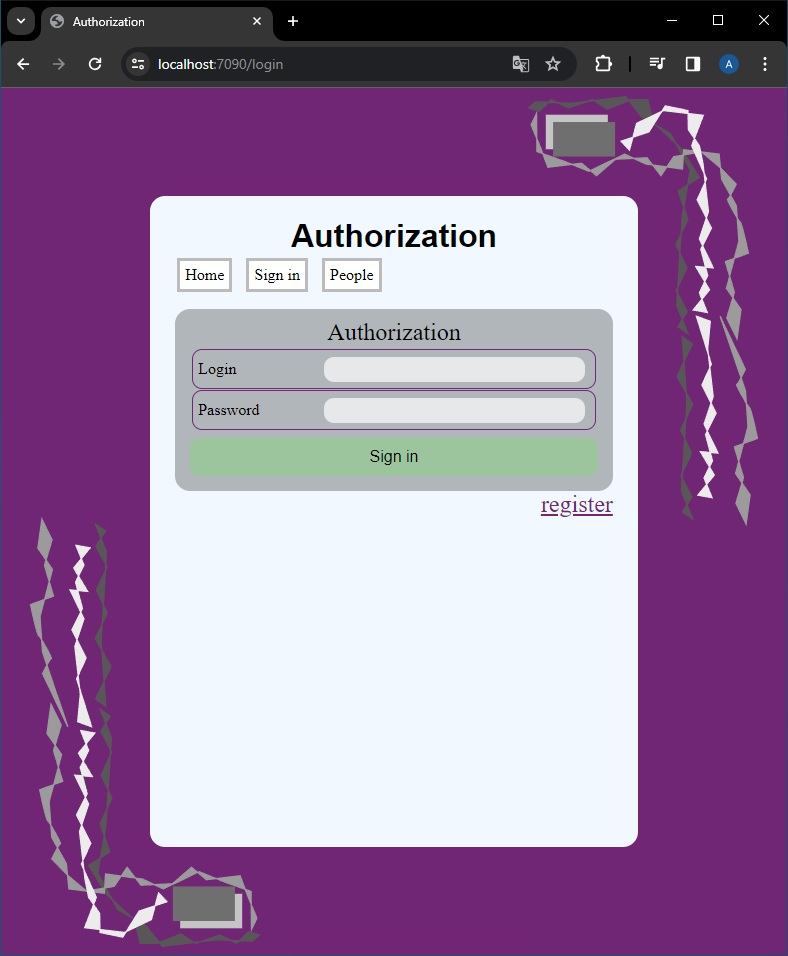
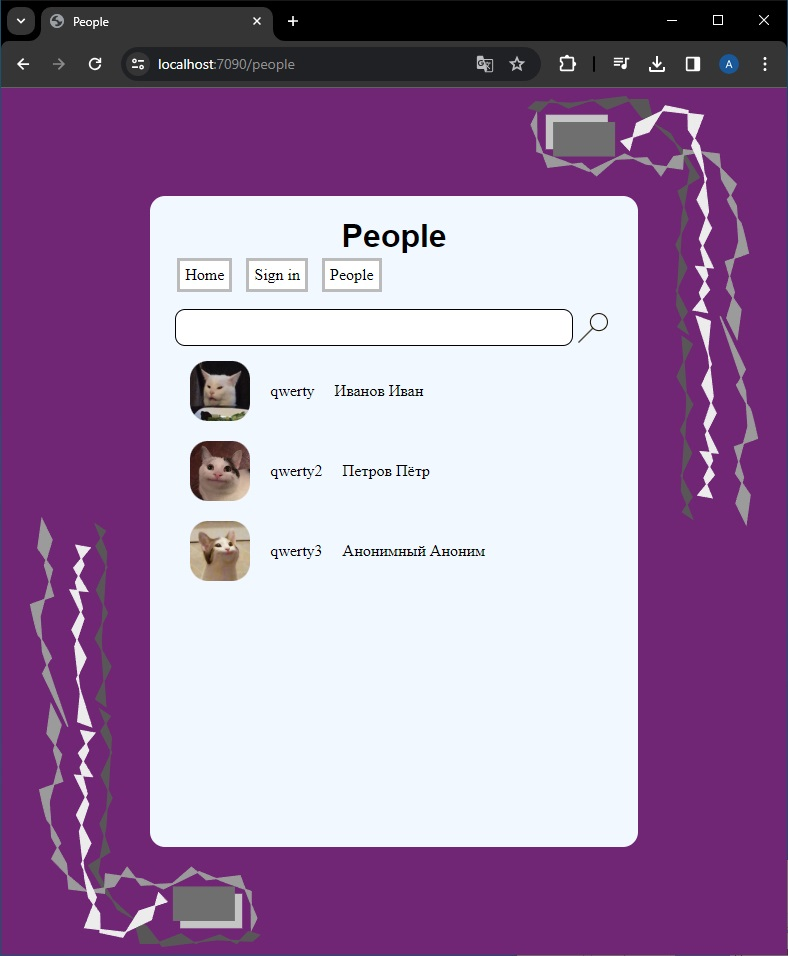
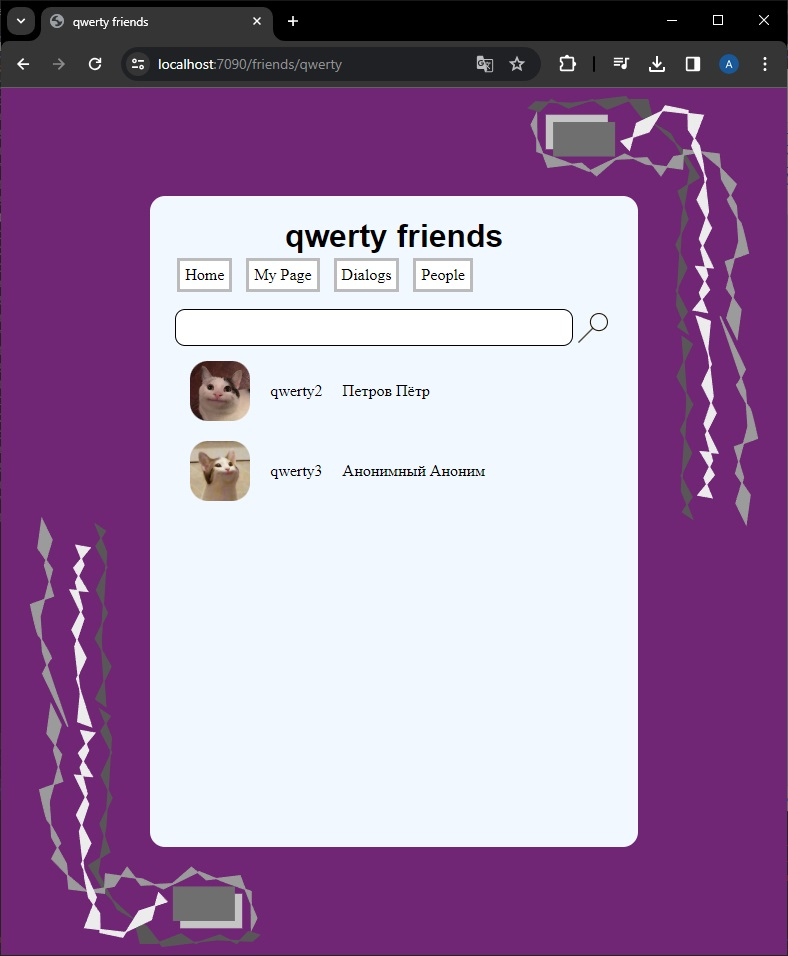
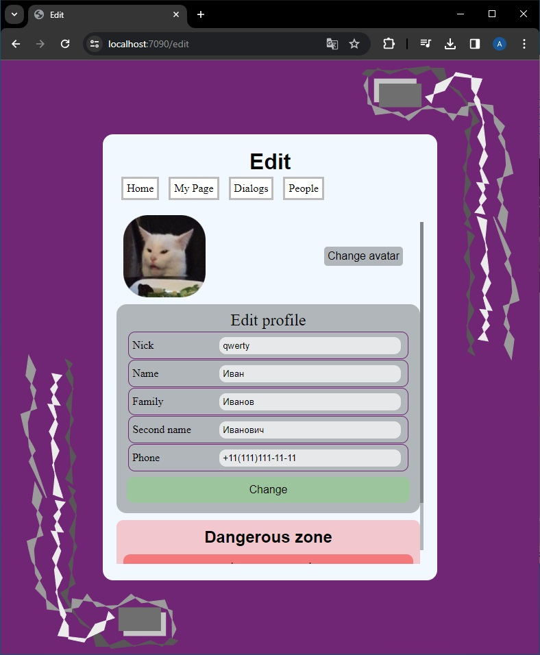
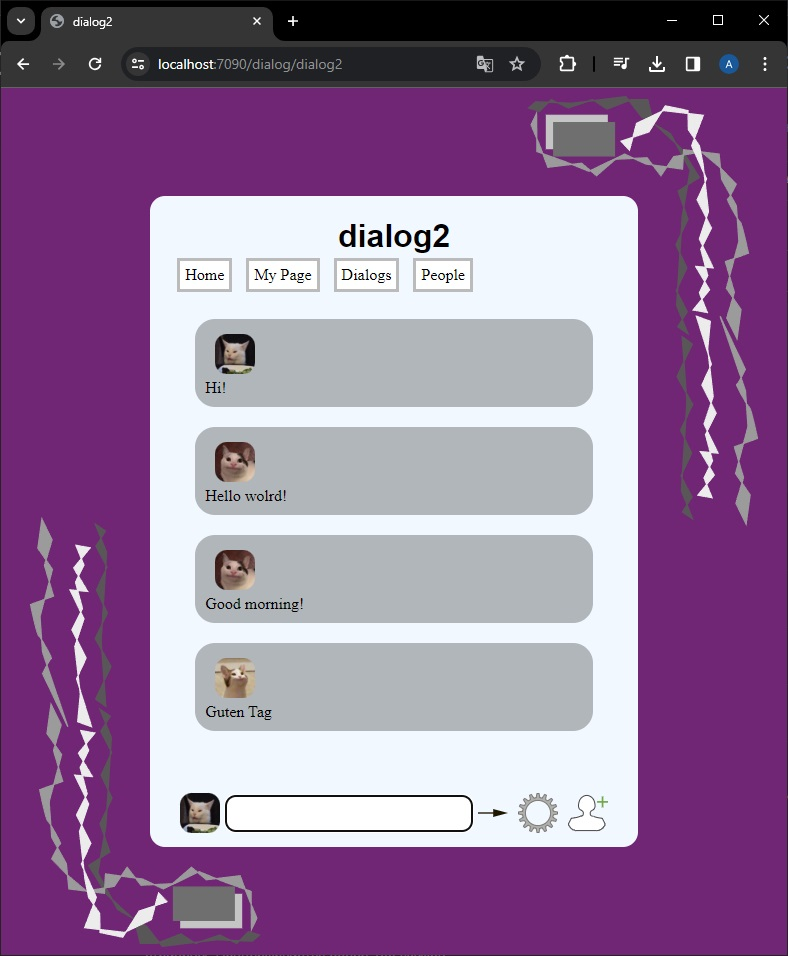

<h1>ConBrains</h1>
<h2>Содержание</h2>
<h3><a href="#enduction">Описание</a></h3>
<h3><a href="#view">Описание внешнего вида приложения</a></h3>
<h3><a href="#release">Подробнее о реализации некоторый элементов</a></h3>
    <h4><a href="#server_release">Реализация серверной части</a></h4>
        <h5><a href="#db_release">Реализация базы данных</a></h5>
        <h5><a href="#jwt_release">Реализация авторизации по jwt</a></h5>
        <h5><a href="#razor_release">Применение Razor</a></h5>
    <h4><a href="#client_release">Реализация клиентской части</a></h4>
        <h5><a href="#load_image_release">Сжатие и загрузка изображений на сервер</a></h5>
        <h5><a href="#update_dialog_release">Реализация обновления диалога в реальном времени</a></h5>

<h2 id="enduction">Описание</h2>

Данный проект является демострационным проектом моих возможностей в веб-разработке.

ConBrains - сокращение от Connection brains. Сам проект представляет стандартную социальную сеть. Серверная часть была написана на фреймворке ASP.NET MVC. клиентская же часть - HTML + CSS + JS с применением Razor. Используемый менеджер пакетов клиентской части - NPM. 
    Данные пользователей хранятся в базе данных, взаимодействие с которой происходит посредством фреймворка EntityFrameworkCore. Авторизация пользователей в системе реализована через jwt. 
    Отправка и получение сообщений в диалоге - через библиотеку Microsoft SignalR.

Ниже будут рассмотрены основные функции и некоторые достаточно значимые проблемы разработки и их решения.

    
<h2 id="view">Описание внешнего вида приложения</h2>

Начальная страница сайта представлена ниже. Для незарегистрированных пользователей доступны только вкладки login с формой авторизации и people с данными всех зарегистрированных пользователей.

    

        
        
Начальная страница

    

    

        
        
Окно авторизации

    

    

        
        
Список пользователей

    

    

В окне авторизации есть возможность перейти в окно регистрации нового пользователя. После авторизации пользователю доступны дополнительные функции такие, как добавление в друзья пользователей, изменение учётных данных и изменение аватарки

    

        
        
Домашняя страница

    

    

        
        
Страница пользователя

    

    

        
        
Список друзей

    

    

        
        
Список пользователей

    

    

        
        
Страница редактирования профиля

    

    

        
        
Страница редактирования пароля

    

Также имеются диалоги

    
    
Список диалогов

    
    
Форма создания диалога

    
    
Открытый диалог

<h2 id="release">Подробнее о реализации некоторый элементов</h2>

<h3 id="server_release">Реализация серверной части</h3>

<h4 id="db_release">Реализация базы данных</h4>

Для работы с базой данных был испрользован EntityFrameworkCore. Код модели можно посмотреть 
<a href="ConBrain/Model/UserDbContext.cs">тут.</a>

Из интересного: дял связывания человека типа Person и его друзей типа Person был введён промежуточный класс FriendPerson. Для тестирования была использована база данный SQLite, 
    однако можно использовать любую из доступных баз данных. Строка подключения к базе данных есть в
<a href="ConBrain/appsettings.json">настройках приложения</a>
. Сгенерированная база данных представлена на рисунке ниже.

    
    
База данных

<h4 id="jwt_release">Реализация авторизации по jwt</h4>

При реализации по jwt возникли некоторые проблемы с его хранением и автоматической отправкой, поэтому было принято решение хранить его в куки, а на стороне сервера создать 
<a href="ConBrain/JwtTokenMiddleware.cs">middleware</a>
, который вписывал его в заголовок запроса из куки.

<h4 id="razor_release">Применение Razor</h4>

При применении Razor помимо стандартных операций возникла желание создать кастомную форму для заполнения из некоторого класса. Для этого был спроектирован 
<a href="ConBrain/TagHelpers/TableFormTagHelper.cs">tag-helper</a>
, который с помощью рефлексии создаёт форму по помеченным свойствам для заполнения.

<h3 id="client_release">Реализация клиентской части</h3>

<h4 id="load_image_release">Сжатие и загрузка изображений на сервер</h4>

Для сжатия и загрузки изображений на сервер они проходят сжатие как на стороне клиента для уменьшения трафика, так и на стороне сервера. Реализация клиентской и серверной частей можно найти 
<a href="ConBrain/wwwroot/js/personPage/edit.js">тут</a> и <a href="ConBrain/Controllers/PersonController.cs">тут.</a>

<h4 id="update_dialog_release">Реализация обновления диалога в реальном времени</h4>

Для реализации обновления диалога в реальном времени была использована библиотека SignalR от Microsoft. Был создан 
<a href="ConBrain/Controllers/Hubs/DialogHub.cs">хаб</a> и <a href="ConBrain/wwwroot/js/personPage/dialog.js">клиент</a> для этого.
